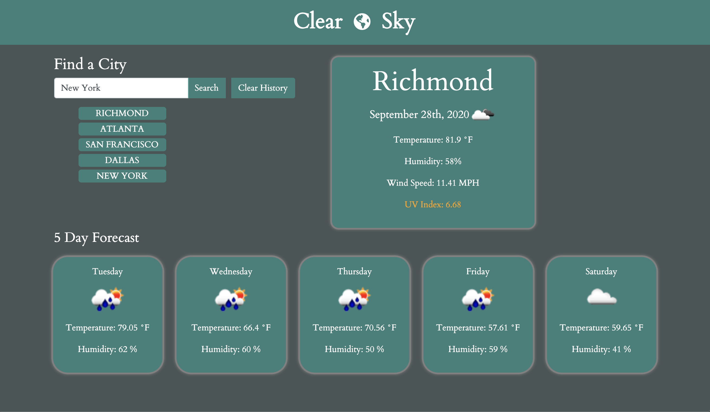

# Clear-Sky-Weather-Dashboard
For this project, I built a weather dashboard application which displays the current weather of a city and it's 5 day forecast.  I utilized the OpenWeatherMap API to retrieve the necessary weather data.  This application also includes the use of local storage which gives users the ability to save their searched cities as well as dynamically created HTML and CSS powered by jQuery.  


## Technologies
**HTML5** <br>
**CSS3** <br>
**JavaScript** <br>
**jQuery** <br>
**Moment.js** <br>
**Bootstrap**

## User Story

```
AS A traveler
I WANT to see the weather outlook for multiple cities
SO THAT I can plan a trip accordingly
```

## Acceptance Criteria

```
GIVEN a weather dashboard with form inputs
WHEN I search for a city
THEN I am presented with current and future conditions for that city and that city is added to the search history
WHEN I view current weather conditions for that city
THEN I am presented with the city name, the date, an icon representation of weather conditions, the temperature, the humidity, the wind speed, and the UV index
WHEN I view the UV index
THEN I am presented with a color that indicates whether the conditions are favorable, moderate, or severe
WHEN I view future weather conditions for that city
THEN I am presented with a 5-day forecast that displays the date, an icon representation of weather conditions, the temperature, and the humidity
WHEN I click on a city in the search history
THEN I am again presented with current and future conditions for that city
WHEN I open the weather dashboard
THEN I am presented with the last searched city forecast

```


## Screenshots



<hr>

## Resources
**Font Awesome** <br>
**Google Fonts**

<hr>


### License & Copyright

Copyright &copy; Tanner Kirkpatrick 2020


